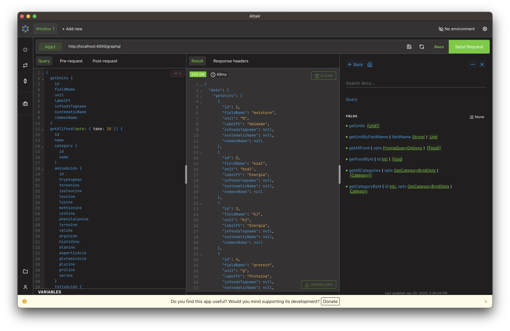

# Taco GraphQL API

> Brazilian Table of Food Composition



<p align="center">
 <a href="https://github.com/raulfdm/taco-api/actions/workflows/ci.yml">
   
 </a>
</p>

## Getting started

Make sure to have installed:

- [Node 20 or higher](https://nodejs.org/en) - For Prisma
- [Bun](https://bun.sh/)

Clone/fork this repo.

Install the dependencies:

```bash
bun install
```

Run the API:

```bash
bun run dev --filter=taco-api
```

## Docs

For more details about this API, check the official docs:

- [Portuguese](https://taco-api.netlify.app/)
- [English](https://taco-api.netlify.app/en)

## License

[MIT](./LICENSE.md)
