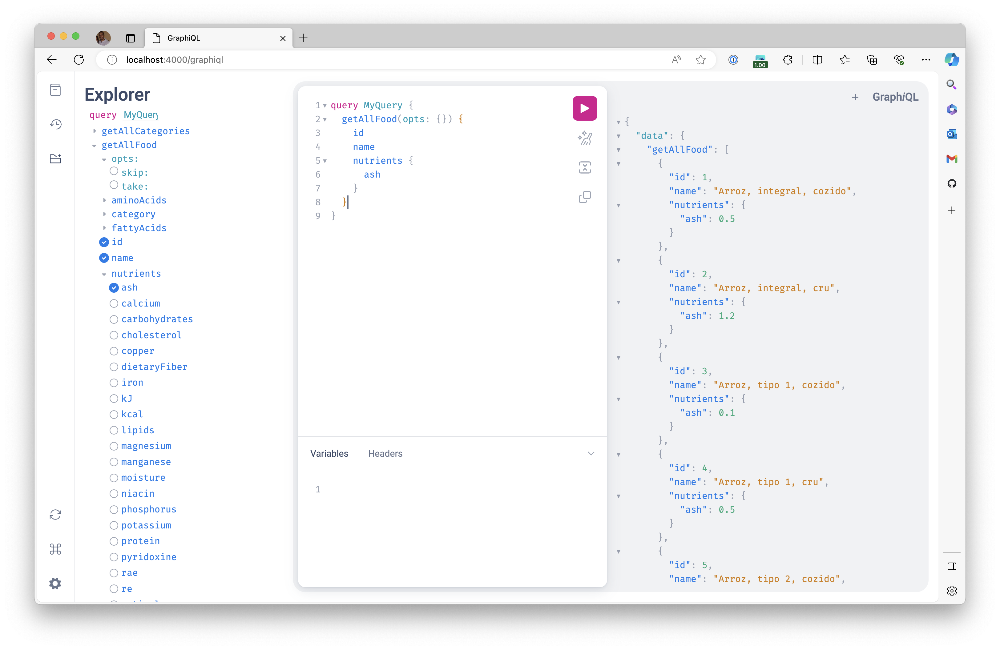

GraphQL é uma linguagem tipada para construção de APIs.

Pelo fato de termos que tipar todos os esquemas, é possível encontrar a documentação na própria aplicação que estamos executando as queries que se beneficiam da técnica de ["introspection"](https://graphql.org/learn/introspection/).

Por padrão, o projeto oferece uma forma de verificar a documentação e rodar queries imbutida usando uma biblioteca chamada [GraphiQL](https://github.com/graphql/graphiql).

Para usá-la, basta acessar o endereço `http://localhost:4000/graphiql` e você verá uma tela assim:

Outra alternativa é você utilizar uma ferramenta própria para isso. Há várias opções como:

- [Postman](https://www.postman.com/)
- [Insomnia](https://insomnia.rest/)
- [Altair](https://altairgraphql.dev/) - Focada em GraphQL.
