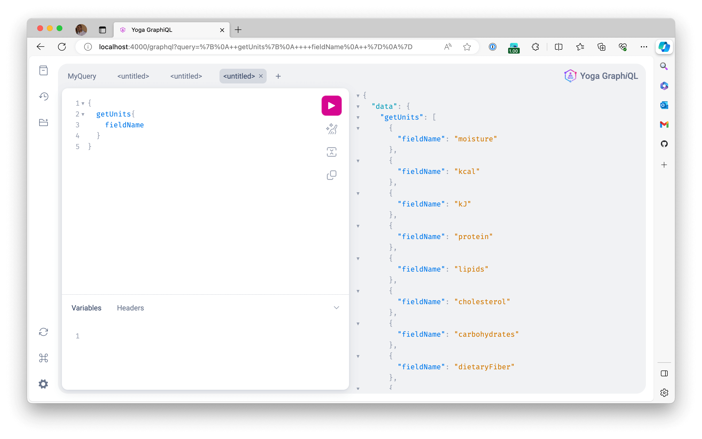

GraphQL é uma linguagem tipada para a construção de APIs.

Pelo fato de termos de tipar todos os esquemas, é possível encontrar a documentação na própria aplicação em que estamos executando as queries, as quais se beneficiam da técnica de ["introspection"](https://graphql.org/learn/introspection/).

O projeto utiliza GraphQL Yoga, que além de criar e implementar a integração da rota `/graphql` para o método POST, ao receber um GET, retorna um playground interativo:

Outra alternativa é utilizar uma ferramenta própria para isso. Há várias opções, como:

- [Postman](https://www.postman.com/)
- [Insomnia](https://insomnia.rest/)
- [Altair](https://altairgraphql.dev/) - Focada em GraphQL.
