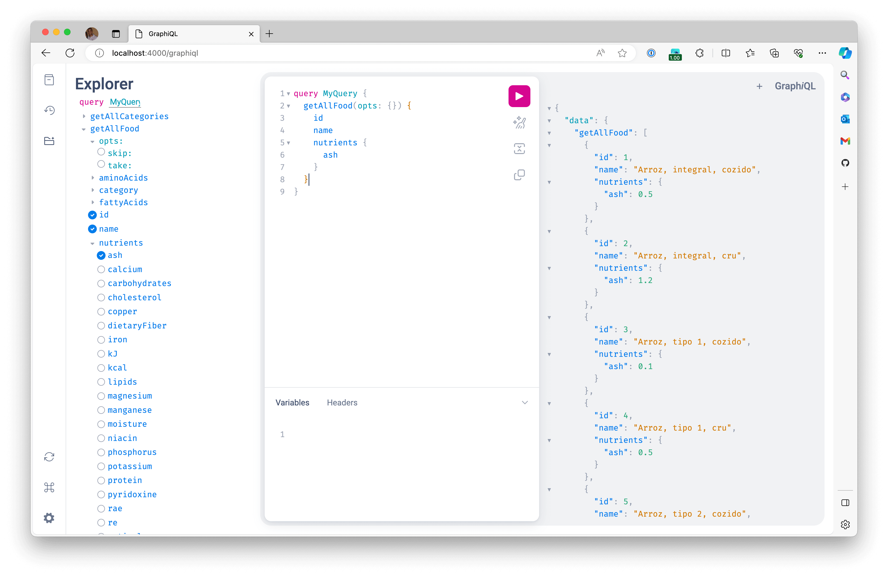

GraphQL is a typed language for building APIs.

Because we have to type all the schemas, it's possible to find the documentation in the application itself where we are executing queries that benefit from the technique of ["introspection"](https://graphql.org/learn/introspection/).

By default, the project offers a way to check the documentation and run embedded queries using a library called [GraphiQL](https://github.com/graphql/graphiql).

To use it, just access the address `http://localhost:4000/graphiql` and you will see a screen like this:

Another alternative is to use a specific tool for this. There are several options such as:

- [Postman](https://www.postman.com/)
- [Insomnia](https://insomnia.rest/)
- [Altair](https://altairgraphql.dev/) - Focused on GraphQL.
